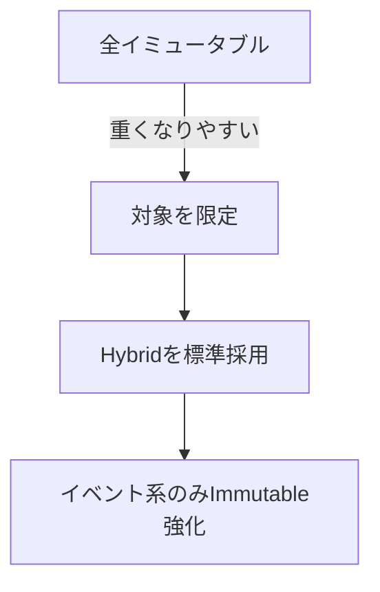
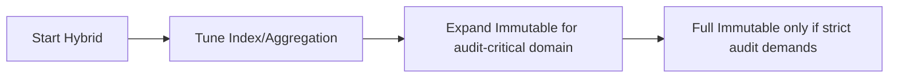

# データモデル方式の実務推奨（結論版）

## 結論
おすすめは Hybrid（現在値テーブル + イベント履歴テーブル）です。  
全テーブルをイミュータブル化する方式は、通常業務では重すぎることが多いため、対象を絞る運用が実務的です。

## 推奨イメージ

## なぜ Hybrid か
- 現在値参照が速い（一覧・検索・API応答が軽い）
- 履歴を保持できる（監査・追跡に対応）
- 実装と運用のバランスが良い（開発速度を落としにくい）

## 推奨方針
- イベント系（状態遷移・承認・入出金・取引）: イミュータブル履歴を採用
- 属性系（プロフィール・設定・補足情報）: 通常の UPDATE モデルを採用
- ステータス管理: `CHECK` ではなく status マスタ + 外部キー

## 非推奨（原則）
- 全テーブルをイミュータブルにする
  - 参照クエリが重くなる
  - テーブル肥大化が早い
  - 開発・保守コストが上がる

## 方式選定の目安
- 監査要件が強い / 改ざん耐性が必要: Hybrid 以上（必要箇所で Immutable）
- 参照性能重視・通常業務中心: Mutable + 必要箇所のみ履歴
- 要件が混在: Hybrid を標準にして対象限定で Immutable を追加

## 最小実装テンプレート
- `users`（現在値）: `created_at`, `update_at`
- `user_status_events`（履歴）: `created_at` のみ（`update_at` なし）
- `status_master`（マスタ）: status 定義を集中管理

## 実務での採用順（推奨）
1. まず Hybrid で開始
2. 性能課題はインデックス・集約で対処
3. 監査が必要な領域だけ Immutable を強化
4. 全面 Immutable は監査要件が極めて強い場合のみ検討

